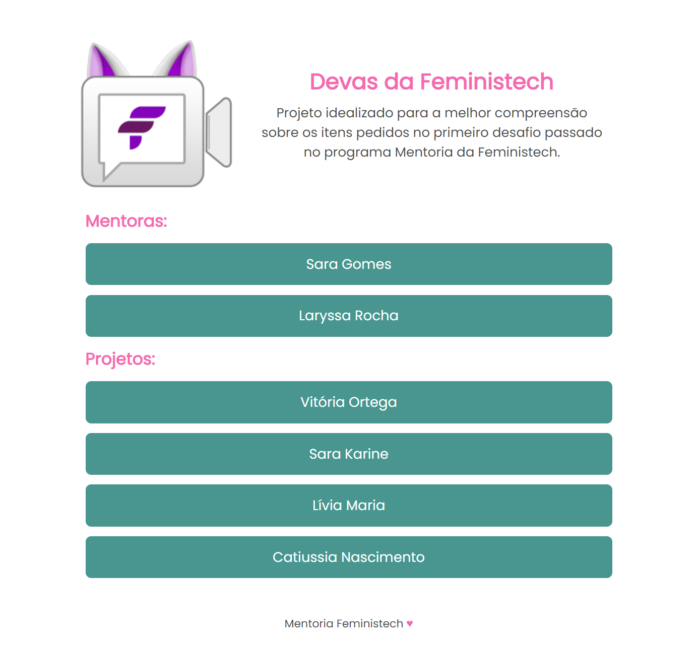

# Devas da Feministech

Projeto idealizado para a melhor compreensão sobre os itens pedidos no primeiro desafio passado no programa Mentoria da Feministech.

## Acesse o projeto online:

- [Devas da Feministech](https://saranascimento.github.io/devas-da-feministech/)

## O que praticamos nesse projeto:

### HTML

- SEMÂNTICA:
  - figure
  - main
  - section
  - nav
  - footer
  - h1/h2
- Listas
  - Lista de links não ordenados

### CSS

- Metodologia BEM
  - Bloco
  - Elemento

### Responsividade

- Design responsivo

### Screenshots do Projeto:

Desktop

Mobile

